## 实验报告

#### ducker
ducker是一个模仿docker的容器demo，实现了一小部分docker的命令
目前已经实现了部分命令，如create创建容器，rm删除容器，exec在容器内执行命令等。接下来展示各个命令的效果，并说明其效果，以及达到的实验目标。
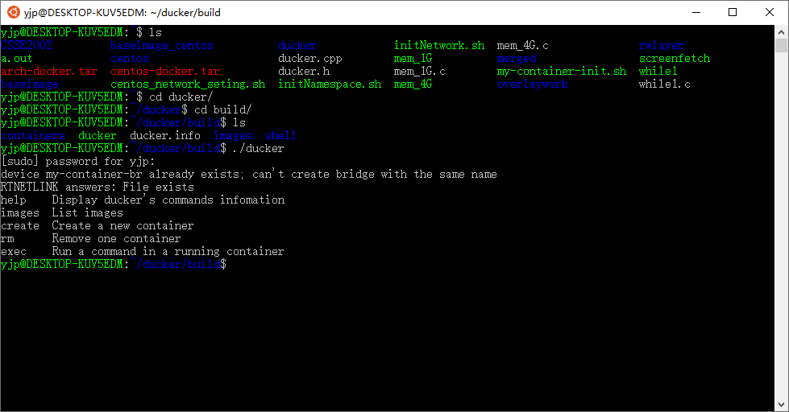
##### images
`ducker images` 列出所有image

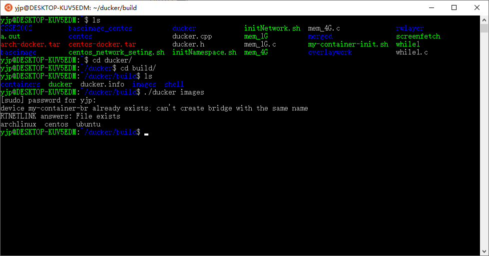
可以看到拥有archlinux，centos，ubuntu三个image

##### create
`ducker create [image] [container]` 生成容器
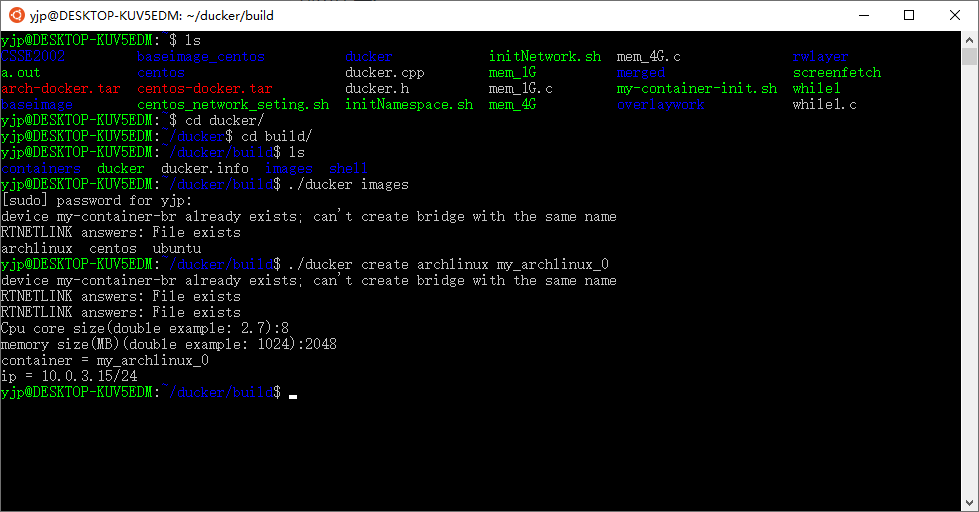
生成容器时，ducker会提示用户输入分配的cpu数量以及内存数量，ducker会为这个container生成对应的cgroup并设置相关信息，以限制container使用的资源。
##### exec
`ducker exec [image] [commands...]` 在容器中执行命令
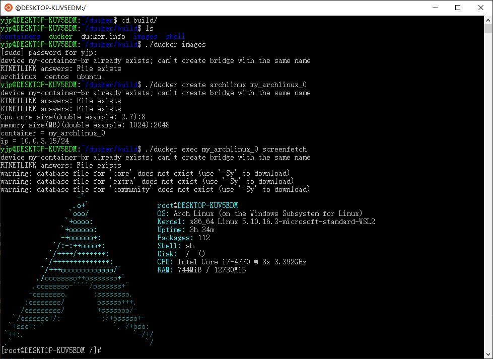
可以发现我们已经成功在ubuntu上运行了archlinux，并执行screenfetch，打印了archlinux的logo。执行完成后，停留在了container的bash，我们接着测试网络以及进程、文件系统的隔离情况。
###### 网络连接测试
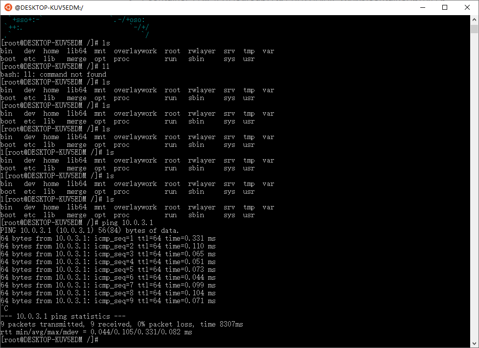
可以看到我们是能ping通host机的。
###### 进程隔离测试
接着我们输入`ps -ef`
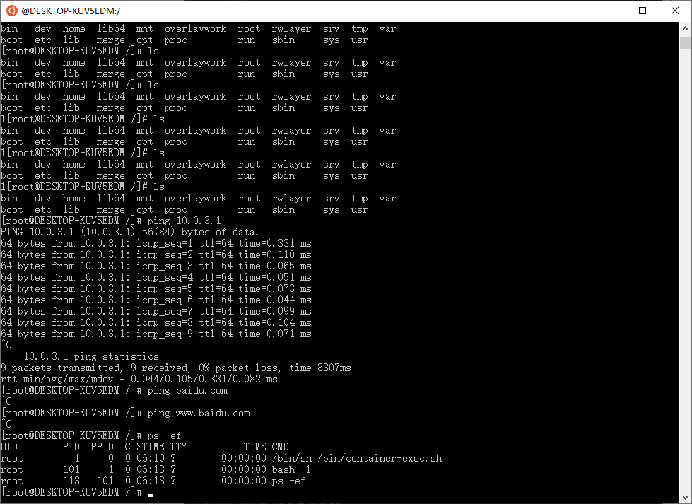
可以见的，我们已经将进程进行了隔离。
###### 文件系统隔离测试
执行`cd ..`仍然在根目录，我们完成了文件系统的隔离
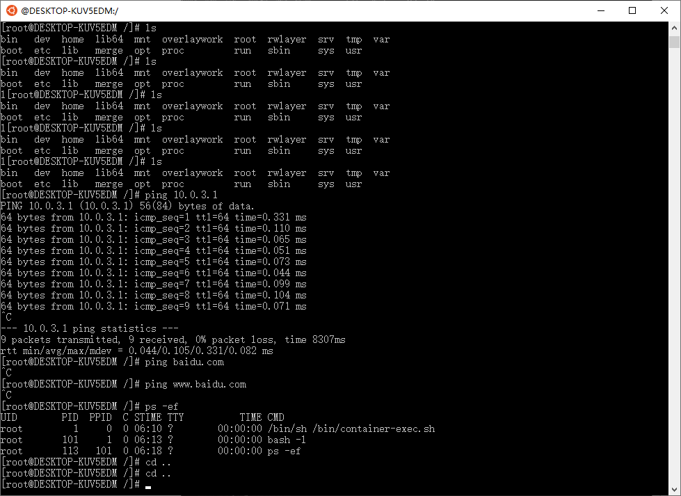
###### 容器间网络互连测试
接着我们开启centos的container，并尝试ping通两个container。
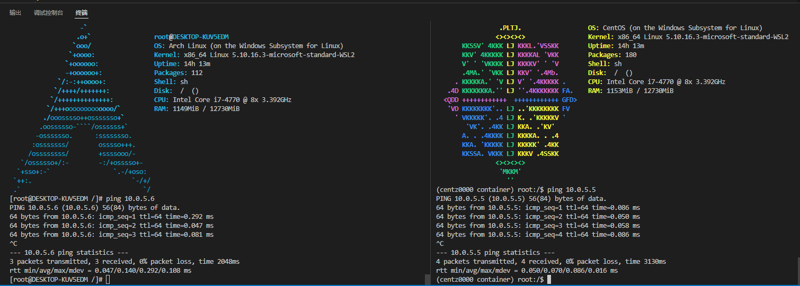
可以见的，两个container已经能够相互ping通。
###### 资源定量分配测试
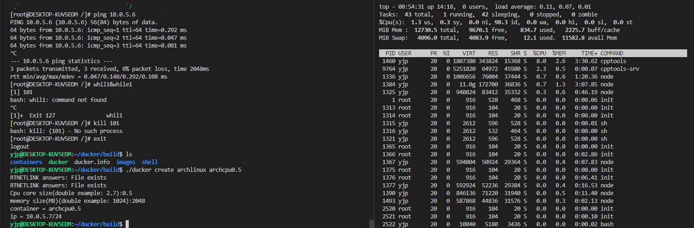
我们给`archcpu0.5`分配了0.5个cpu资源以及2GB的内存，接下来进行资源测试
执行`while1`程序，可以见的cpu资源保持在50%说明只使用了50%的cpu资源
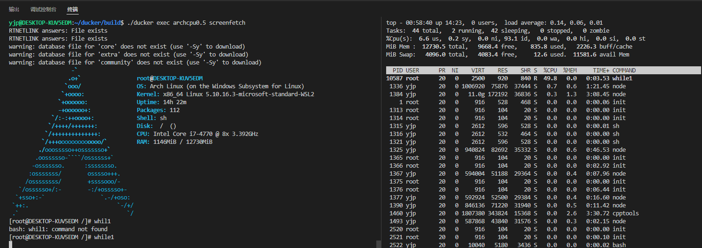
我们给`archmem4G`分配了8个cpu资源以及4GB的内存，接下来进行内存资源测试
执行`memtester 4000M`程序，可以见得程序占据了31.4%的内存，说明已经成功分配了4000M的内存
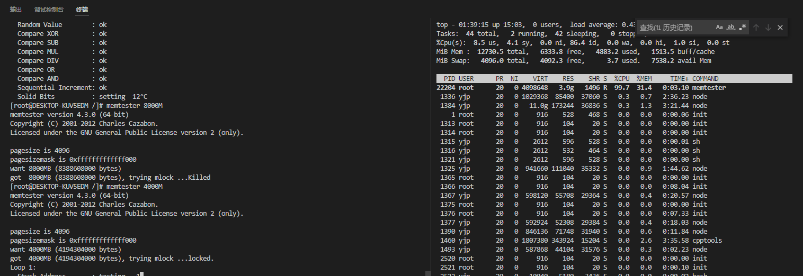
当我们执行`memtester 8000M`程序时，发现程序已经被杀死了，无法分配这么多内存，说明我们的内存资源控制也是有效的。
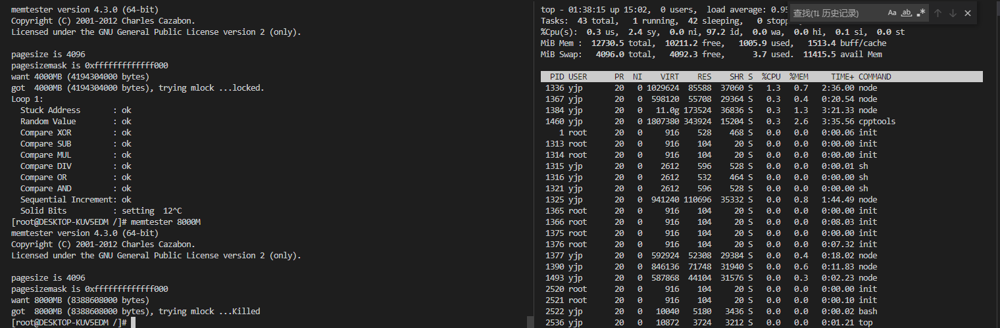
